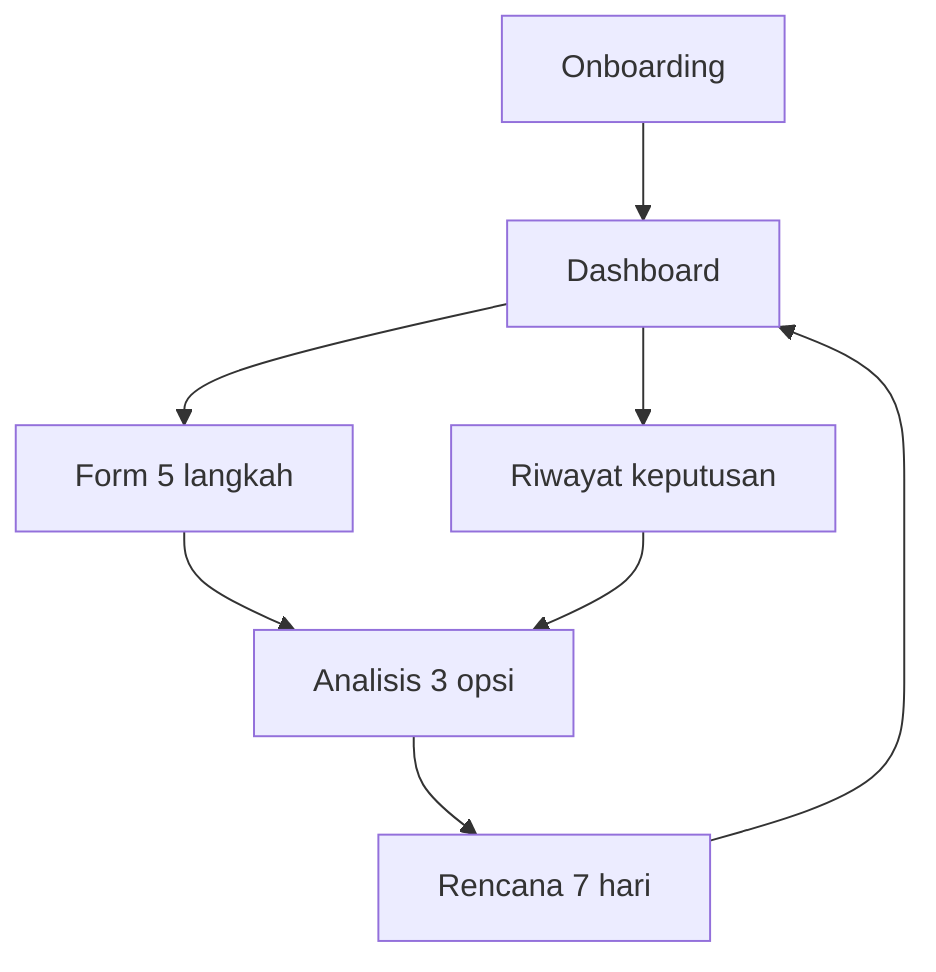

# PanenPintar

> Asisten keputusan untung-rugi untuk petani kecil di Indonesia.

PanenPintar membantu petani menjawab satu pertanyaan yang paling sering muncul di lapangan:

> "Tanaman saya ada gejala. Saya harus rawat, panen lebih awal, atau biarkan saja? Mana yang paling menguntungkan?"

Berbeda dengan aplikasi diagnosis tanaman lain yang hanya menampilkan "kemungkinan penyakit", PanenPintar menyimulasikan **tiga skenario tindakan sekaligus** dengan perhitungan biaya, hasil panen, profit, dan tingkat risiko — lalu memberikan rekomendasi terbaik beserta rencana aksi 7 hari yang konkret.

## Daftar isi

- [Latar belakang](#latar-belakang)
- [Nilai jual aplikasi](#nilai-jual-aplikasi)
- [Fitur utama](#fitur-utama)
- [Tampilan & alur pengguna](#tampilan--alur-pengguna)
- [Arsitektur kode](#arsitektur-kode)
- [Logika engine keputusan](#logika-engine-keputusan)
- [Cara menjalankan](#cara-menjalankan)
- [Build untuk berbagai platform](#build-untuk-berbagai-platform)
- [Skenario demo yang disarankan](#skenario-demo-yang-disarankan)
- [Stress test](#stress-test)
- [Dasar perhitungan & referensi](#dasar-perhitungan--referensi)
- [Roadmap pengembangan](#roadmap-pengembangan)
- [Disclaimer](#disclaimer)

## Latar belakang

Menurut FAO, hama dan penyakit tanaman menyebabkan **kehilangan hasil panen hingga 40%** secara global setiap tahun, dengan nilai kerugian sekitar USD 220 miliar. Di Indonesia, petani kecil sering kehilangan panen karena keputusan tindakan yang terlambat: gejala muncul, ragu apa yang harus dilakukan, dan akhirnya kerugian membesar.

Aplikasi diagnosis tanaman yang ada (Plantix, TaniDoc, SinTa, Dr. Tania) sangat baik dalam mengidentifikasi **apa** masalahnya. PanenPintar mengisi celah berikutnya: membantu petani memilih **tindakan apa** yang paling menguntungkan, lengkap dengan estimasi rupiah.

## Nilai jual aplikasi

| Aspek | Aplikasi diagnosis lain | PanenPintar |
|---|---|---|
| Output utama | Nama penyakit | Keputusan tindakan |
| Pertimbangan ekonomi | Tidak ada | Biaya, hasil panen, profit |
| Perbandingan opsi | Tidak ada | 3 opsi side-by-side |
| Rencana aksi | Umum | Linimasa 7 hari konkret |
| Mode operasi | Butuh internet | Offline, ringan |
| Akuntansi biaya panen | Tidak diperhitungkan | Termasuk semua opsi |

## Fitur utama

- **Onboarding singkat** dengan penjelasan nilai utama aplikasi.
- **Dashboard adaptif** untuk akses cepat ke komoditas dan keputusan terakhir.
- **Form 5 langkah** dengan indikator progres: komoditas, umur tanam, gejala, cuaca, lahan & anggaran. Form menampilkan harga acuan komoditas, progress umur tanam real-time, serta input lahan/anggaran dengan slider dan kolom angka langsung. State otomatis tersimpan saat berpindah halaman.
- **Analisis 3 opsi**: Rawat Sekarang, Panen Lebih Awal/Panen Sekarang, Tunggu & Pantau. Setiap opsi menampilkan profit, biaya, hasil, keyakinan, dan alasan.
- **Rencana 7 Hari** berupa linimasa langkah harian sesuai rekomendasi terbaik.
- **Riwayat keputusan dapat diklik** untuk membuka kembali analisis lama secara penuh.
- **Layout responsif** desktop / tablet / mobile dengan NavigationRail di kiri (desktop) atau NavigationBar di bawah (mobile).
- **Mode offline** tanpa registrasi, tanpa backend.

## Tampilan & alur pengguna

Flow utama:



## Arsitektur kode

```
src/
  main.py                 # entry point Flet
  app/
    bootstrap.py          # konfigurasi page + tema + window
    shell.py              # responsive shell (NavigationRail/NavigationBar)
    store.py              # AppState, form_draft, history dengan snapshot
    theme.py              # design tokens (palet, spacing, radius)
    ui.py                 # primitives: card, pill, stat_tile, chip_select
    data.py               # katalog komoditas, gejala, engine keputusan
    views/
      onboarding.py
      dashboard.py
      form.py
      analysis.py
      plan.py
      history.py
scripts/
  stress_test.py          # 10 skenario uji untuk engine
```

Prinsip:

- **State terpusat** di `AppState` — semua view membaca/menulis dari satu sumber.
- **Engine murni** di `data.py` — tanpa dependensi UI, mudah diuji.
- **Primitives reusable** di `ui.py` — semua kartu, pill, tombol memakai komponen yang sama.
- **Tema seragam** di `theme.py` — palet warna konsisten di seluruh aplikasi.

## Logika engine keputusan

Engine adalah **rule-based deterministic**, bukan AI/ML. Output selalu dapat dijelaskan dan reproducible. Lima tahap:

### 1. Hitung skor risiko (0–1)

```
raw_risk   = jumlah_bobot_gejala × 0.75 + penalti_cuaca
risk_score = min(raw_risk, 1.0)
```

Kategori: `< 0.25` low, `0.25–0.54` medium, `≥ 0.55` high.

Bobot gejala mengikuti tingkat keparahan agronomi (mis. busuk buah 0.35, tanah kering 0.15). Penalti cuaca: cerah 0, berawan 0.05, hujan 0.10, hujan lebat 0.20.

### 2. Hitung biaya panen tetap

```
harvest_cost = luas_lahan × Rp400
```

Biaya panen ini **dikenakan ke ketiga opsi**, karena petani pasti memanen di akhir siklus. Tanpa ini, opsi Tunggu akan terlihat tidak adil-untung.

### 3. Simulasikan tiga opsi

**Opsi A — Rawat Sekarang**

```
biaya     = anggaran + luas × Rp250 + harvest_cost
care_factor = 0.30 + max(0, risk - 0.6) × 0.5      # makin parah, perawatan kurang efektif
retained  = max(0.30, 1 - risk × care_factor)
profit    = hasil × harga × retained - biaya
```

**Opsi B — Panen Lebih Awal / Panen Sekarang**

```
diperbolehkan jika umur >= 60% siklus
diskon    = (1 - age_ratio) × 0.625    # turun linear dari 25% ke 0%
retained  = min(1.0, age_ratio) × (1 - diskon)
harga_jual = harga × (1 - diskon × 0.4)
biaya     = harvest_cost
profit    = hasil × harga_jual × retained - biaya
```

Label kartu otomatis berubah ke "Panen Sekarang" saat tanaman matang penuh dan diskon = 0.

**Opsi C — Tunggu & Pantau**

```
biaya     = harvest_cost
retained  = 1 - risk × 0.70
profit    = hasil × harga × retained - biaya
```

### 4. Pilih rekomendasi terbaik

Bukan asal profit tertinggi. Engine memberi **penalti risiko**:

```
score = profit + risk_penalty + availability_penalty
risk_penalty = { low: 0, medium: -50.000, high: -200.000 }
```

Filosofi: petani kecil tidak punya banyak modal cadangan, jadi lebih baik untung sedikit lebih kecil tapi aman, daripada untung besar yang berisiko gagal panen.

### 5. Hitung tingkat keyakinan (confidence)

Confidence mengukur **kecocokan opsi dengan kondisi saat ini**, bukan profit:

- **Rawat**: puncak di sekitar risk 0.5; turun saat tanaman sehat (overkill) atau parah (sulit diselamatkan).
- **Tunggu**: tinggi saat risk rendah; turun tajam saat risk tinggi.
- **Panen Awal/Sekarang**: tinggi saat tanaman mendekati/melewati 100% siklus.

Dengan pendekatan ini, opsi yang direkomendasikan selalu memiliki confidence yang sejalan.

## Cara menjalankan

Prasyarat: Python 3.10+ dan `pip`. Koneksi internet diperlukan untuk instalasi pertama.

### Setup (Windows PowerShell)

```powershell
python -m venv .venv
.\.venv\Scripts\Activate.ps1
pip install -r requirements.txt
```

Jika `requirements.txt` belum ada, instal dependensi langsung dari `pyproject.toml`:

```powershell
pip install flet flet-cli flet-desktop flet-web
```

### Setup (macOS / Linux)

```bash
python -m venv .venv
source .venv/bin/activate
pip install flet flet-cli flet-desktop flet-web
```

### Jalankan sebagai aplikasi desktop

```bash
flet run src/main.py
```

### Jalankan sebagai aplikasi web

```bash
flet run --web src/main.py
```

Aplikasi web akan dibuka pada `http://127.0.0.1:<port>` dan otomatis menyesuaikan layout tergantung lebar jendela browser.

Jika menjalankan dari konfigurasi Flet di `pyproject.toml`, perintah singkat berikut juga dapat digunakan:

```bash
flet run
flet run --web
```

## Build untuk berbagai platform

### Android

```bash
flet build apk -v
```

### iOS

```bash
flet build ipa -v
```

### Windows

```bash
flet build windows -v
```

### macOS

```bash
flet build macos -v
```

### Linux

```bash
flet build linux -v
```

### Web

```bash
flet build web -v
```

Untuk GitHub Pages, project ini sudah menyediakan workflow `.github/workflows/build-deploy.yml`. Workflow tersebut membuild web app dengan `uv` dan memakai route hash agar cocok untuk hosting statis:

```bash
uv run flet build web --yes --verbose --base-url <nama-repository> --route-url-strategy hash
```

Deploy otomatis berjalan saat ada push ke branch `main`, sedangkan pull request hanya menjalankan build check.

## Skenario demo yang disarankan

Skenario presentasi yang paling bercerita:

1. **Buka onboarding**, jelaskan nilai utama: bukan diagnosis, melainkan keputusan untung-rugi.
2. **Pilih komoditas Cabai Merah** lewat Dashboard.
3. **Isi form**: umur 70 hari, gejala daun menguning + bercak daun, cuaca hujan, lahan 120 m², anggaran Rp500.000. Tunjukkan juga harga acuan komoditas serta input lahan/anggaran yang bisa digeser atau diketik langsung.
4. **Lihat hasil analisis**: rekomendasi Rawat Sekarang dengan profit sekitar Rp2.6 juta, confidence ~91%. Tunjukkan ketiga opsi side-by-side.
5. **Buka rencana 7 hari**: linimasa langkah harian.
6. **Simpan** dan kembali ke Dashboard. Tunjukkan kartu "Keputusan terakhir".
7. **Pindah ke Riwayat**, klik kartu → analisis lengkap muncul kembali.

Untuk menonjolkan responsivitas: tarik ujung jendela browser dari lebar penuh sampai sempit. NavigationRail di kiri akan berubah menjadi NavigationBar di bawah secara otomatis.

## Stress test

10 skenario uji tersedia di `scripts/stress_test.py`:

```bash
.venv\Scripts\python.exe scripts\stress_test.py
```

Skenario meliputi: tanaman sehat sempurna, risk rendah/sedang/tinggi, umur terkunci, matang penuh, lewat siklus, lahan mini, lahan besar, dan padi parah. Output menampilkan rekomendasi, profit, biaya, hasil, dan confidence per opsi.

## Dasar perhitungan & referensi

Pendekatan **rule-based** menyederhanakan tiga konsep agronomi yang sudah didukung literatur:

1. **Hama dan penyakit dapat menyebabkan kehilangan hasil hingga 40%** ([FAO One Health, 2024](https://www.fao.org/one-health/highlights/how-plant-diseases-threaten-global-food-security/en)).
2. **Kelembapan dan curah hujan tinggi meningkatkan risiko penyakit jamur** pada padi, cabai, bawang merah, dan tanaman tropis lainnya (Frontiers in Sustainable Food Systems, 2022; UGM JPTI).
3. **Panen sebelum fase matang penuh menurunkan hasil dan harga** (HortScience, Acta Horticulturae).

Siklus tanam mengikuti referensi umum budidaya Indonesia:

| Komoditas | cycle_days | Harga acuan/kg |
|---|---:|---:|
| Cabai Merah | 90 | Rp35.000 |
| Padi | 110 | Rp7.000 |
| Jagung | 100 | Rp6.000 |
| Tomat | 70 | Rp12.000 |
| Kentang | 110 | Rp14.000 |
| Bawang Merah | 65 | Rp28.000 |

Sumber: Agropedia, PTT Kementan, Liputan6.

## Roadmap pengembangan

Versi MVP ini fokus pada arsitektur dasar dan kelogisan. Pengembangan lanjutan:

- **Kalibrasi bobot dari data riil** — bekerja sama dengan penyuluh lapangan untuk menyesuaikan bobot gejala dan penalti cuaca per komoditas dan per wilayah.
- **Tambahan fase fenologi tanaman** — vegetatif vs generatif vs masak — agar dampak gejala lebih akurat.
- **Harga pasar dinamis** — integrasi dengan Pasar Info Komoditas atau API harga lokal.
- **Foto-based screening** — opsional integrasi model klasifikasi gambar untuk membantu pengisian gejala.
- **Sinkronisasi dengan penyuluh** — opsi membagikan ringkasan keputusan ke nomor WhatsApp penyuluh setempat.
- **Multi-bahasa daerah** — Jawa, Sunda, Madura, dll.

## Disclaimer

PanenPintar adalah alat bantu estimasi cepat untuk pengambilan keputusan awal. Bobot gejala, penalti cuaca, harga jual, dan parameter ekonomi bersifat heuristik. Aplikasi ini **tidak menggantikan konsultasi dengan penyuluh pertanian setempat**. Untuk keputusan dengan dampak besar, petani tetap disarankan memvalidasi rekomendasi ke ahli di lapangan.
